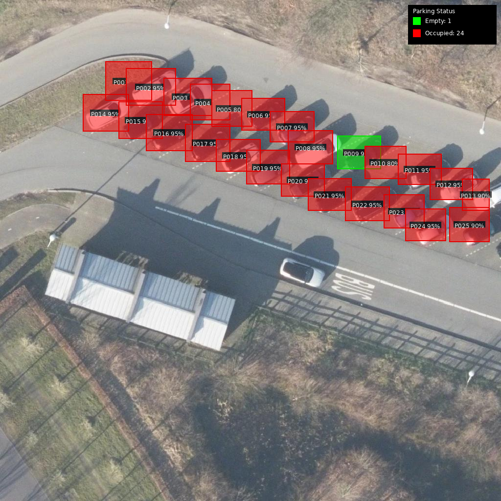

# 🅿️ Dutch Parking Space Detection System

A sophisticated AI-powered pipeline for detecting parking spaces and their occupancy in the Netherlands using high-resolution aerial imagery.

## 📋 Overview

This system automates the analysis of parking capacity and utilization by:
1.  Fetching 8cm resolution aerial imagery from the Dutch government (PDOK).
2.  Using Google's **Gemini 3 Flash** vision model to detect parking spots.
3.  Classifying spots as **Empty** or **Occupied**.
4.  Georeferencing all detections from pixel coordinates to real-world WGS84 GPS coordinates.
5.  Exporting results as standard GeoJSON files compatible with GIS software (QGIS, ArcGIS, Google Earth).

## ✨ Key Features

-   **High-Res Imagery:** Automatically fetches and tiles "Actueel Ortho HR" (8cm/pixel) imagery from PDOK WMS services.
-   **Advanced AI Detection:** Uses a two-step prompt engineering approach with Gemini 3 Flash to separate structural detection from occupancy analysis.
-   **Accurate Geocoding:** Handles complex coordinate transformations between Dutch RD (Rijksdriehoek, EPSG:28992) and Global WGS84 (EPSG:4326).
-   **Spatial Deduplication:** Intelligent merging of detections across overlapping image tiles to prevent double-counting.
-   **GeoJSON Export:** Rich output including confidence scores, area calculations, and direct links to Google Maps/PDOK Viewer for verification.

## 🚀 Installation

### Prerequisites
-   Python 3.9+
-   A Google Cloud Project with the Gemini API enabled
-   A Gemini API Key

### Setup

1.  Clone the repository:
    ```bash
    git clone https://github.com/yourusername/parking-detection-system.git
    cd parking-detection-system
    ```

2.  Install dependencies:
    ```bash
    pip install -r requirements.txt
    ```

3.  **Configuration**: Set your Google API key as an environment variable:
    ```bash
    # Linux/macOS
    export GEMINI_API_KEY="your-api-key-here"

    # Windows (PowerShell)
    $env:GEMINI_API_KEY="your-api-key-here"
    ```

## 💻 Usage

The system is primarily run via the command-line interface (CLI) using the `src.main_pipeline` module.

### Basic Usage
Process an entire municipality (e.g., Amersfoort):
```bash
python -m src.main_pipeline Amersfoort --output results/
```

### Test Mode
Process a small 1km² test area in the center of a municipality (useful for quick verification):
```bash
python -m src.main_pipeline Amersfoort --test --output test_results/
```

### Custom Bounding Box
Process a specific area defined by Dutch RD coordinates (West, South, East, North):
```bash
python -m src.main_pipeline --bbox 155000 463000 156000 464000 --output custom_area/
```

## 📊 Output

The pipeline generates a **GeoJSON** file (e.g., `amersfoort_20231027_120000.geojson`) containing:

-   **Polygons:** Exact boundaries of every detected parking spot.
-   **Properties:**
    -   `is_occupied`: Boolean status (True/False).
    -   `confidence`: AI confidence score.
    -   `area_sqm`: Area in square meters.
    -   `map_links`: Direct URLs to view the spot on Google Maps or PDOK.

Example Visualization of output:

*(Green = Empty, Red = Occupied)*

## 📚 Documentation

-   [Architecture Overview](docs/ARCHITECTURE.md) - Deep dive into the pipeline logic, coordinate systems, and AI strategy.
-   [Development Guide](docs/DEVELOPMENT.md) - How to contribute, run tests, and understand the code structure.

## ⚖️ License

[MIT License](LICENSE)
